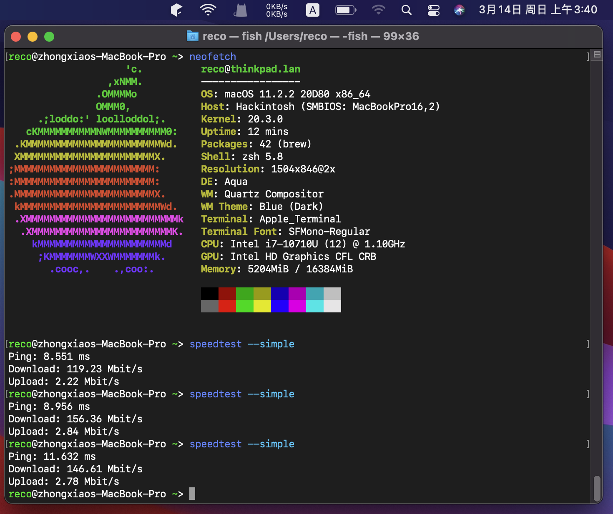

# ThinkPad-X1C7-OpenCore
ThinkPad X1 Gen7 CometLake OpenCore EFI

### Device Info

|       |                           |
| ----- | ------------------------- |
| CPU   | Intel CometLake i7 10710U |
| iGPU  | Intel UHD620              |
| RAM   | 16GB 2133Mhz LPDDR3       |
| SSD   | INTEL SSDPEKKF010T8L 1TB  |
| Audio | Realtek ALC285            |
| WIFI  | Intel AC9560              |

### What's Working

* iGPU with acceleration
* WIFI using HeliPort
* Lid
* Sleep
* Trackpoint
* Keyboard 
* Touchpad
* Only two keyboard-side speaks working with terrible sound quality
* Two USB-A
* 3.5 audio jack both sound and mic work fine.
* Media Keys

### What's NOT Working

* Bluetooth
* Airdrop, Handoff, Sidecard ...
* Webcam

I have not tested HDMI and Type-C.

----

##### AC9560 can NOT reach 100% performance

speedtest with itswm.kext and HeliPort

### Extra

Triple boot

